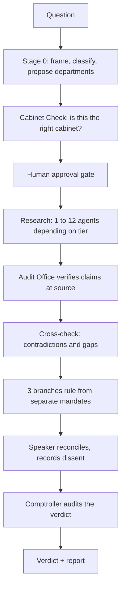

# Quorum

A deliberation skill for Claude Code. Puts a hard question to a small government instead of a single assistant, and verifies its own answers.


Most multi-agent setups ask several models the same question and synthesise the answers. Nobody checks whether any of it is true. Five well-argued answers can rest on a figure one of them invented, and peer review will not catch it, because reviewers assess reasoning rather than facts.

Quorum adds an Audit Office whose only job is verification, including a final audit of the verdict itself. It has caught its own verdict out twice.

See [CHANGELOG.md](CHANGELOG.md) for what changed in each version and why.

## Install

```bash
git clone https://github.com/Caleb-Boddington/quorum.git ~/.claude/skills/quorum
```

Windows:

```powershell
git clone https://github.com/Caleb-Boddington/quorum.git $env:USERPROFILE\.claude\skills\quorum
```

Then restart Claude Code. `SKILL.md` sits at the root, and reads `references/prompts.md` and `references/report.md` as it runs.

## Usage

```
/quorum should we migrate off Postgres before the next funding round?
```

It stops before spending anything and asks which tier to run. It will not fire on its own.

## When it earns its cost

Convene it when a single confident answer would probably be wrong, or when the working matters as much as the conclusion. That covers decisions with real trade-offs, contested facts where sources disagree, evaluations that turn on a definition nobody has agreed, diagnostics where the obvious cause is often wrong, and plans you have half-committed to and want attacked properly.

Do not convene it for anything one search settles, for writing or summarising tasks, or for an answer you have already reached and want validated. It will tell you things you would rather not hear. That is the function.

## Tiers

| Tier | Agents | Structure |
|---|---|---|
| Rapporteur | 10 | 1 investigator, 1 shadow, 1 auditor, 3 branches, Speaker, Comptroller |
| Quick | 12 | 3 self-researching departments, 1 auditor, 1 cross-checker, + the above |
| Standard | 24 | 3 departments with researcher/scrutineer pairs, 3 auditors, 2 reviewers |
| Full | 40 | 6 departments, 12 workers, 6 auditors, 6 reviewers with distinct lenses |

Every tier includes two Cabinet Check agents at Stage 0 and the same six jobs. Cheaper tiers do those jobs at a smaller size; they never skip one. Every verdict states which tier ran and what it therefore did not check.

Agent counts, not costs. A measured Full run used 38.3M tokens, of which 99.5% was cache. Cost tracks context carried per agent, not agent count.

Rapporteur is the recommended default. It beat Quick head to head on the same question with two fewer agents.

## How it works



Four bodies, each with one job and one prohibition:

- **Executive** rules on what follows in practice. May not rule on whether it is worth wanting.
- **Legislature** rules on whether it is the right question and what it costs. May not design the plan.
- **Judiciary** rules on whether the reasoning holds. **May not propose anything.**
- **Audit Office** verifies claims. Reports to none of the branches. May not hold an opinion on the answer.

Three rules hold the shape:

- Every tier gets less context than the tier above. Workers see one task; branches see everything.
- Nobody audits their own work.
- The dissent is published, at full strength, with the condition that would make it correct.

## The Cabinet Check

Quorum picks a fresh set of departments for every question, which used to be the one decision in a run with nothing checking it. A run deliberately convened with the wrong departments produced three competent, well-sourced reports, passed both the auditor and the cross-checker, and died only at the branches after all the research had been paid for.

The reason it survived that long is worth stating: the auditor verifies claims *within* a report, and three accurate reports pass. The cross-checker hunts contradictions *between* reports, and three irrelevant reports do not contradict each other. Every check verified work against a frame. Nothing tested the frame.

The fix is two agents at Stage 0. The first sees the question and nothing else, and writes what the question turns on. The second maps the proposed departments against that list and rules FIT, GAPS or UNFIT. The first agent never sees the cabinet, which is the whole design: a reviewer shown the cabinet is anchored by it and ratifies rather than checks.

## Controls

Built by reasoning about failure, not from a framework, but several of the results are standard controls:

| Control | Status |
|---|---|
| Separation of duties | Held across every run |
| Three lines of defence | Third line has caught the second line's misses |
| Independent assurance | Implemented |
| Adversarial review | Implemented |
| Evidence provenance | Source, date and rank on every claim |
| Data classification at intake | Added after a real failure |
| Check on the frame, not just the work | Added in v1.7.0, tested on one question |
| Change control | Every defect and fix in [CHANGELOG.md](CHANGELOG.md) |
| Input validation | In the spec, not enforced by code |
| Tamper-evident audit log | Absent |
| Abort mid-run | Absent |

See [SECURITY.md](SECURITY.md).

## Known limitations

- Every agent is the same model. Independence comes from prompts, not architecture. Five instances given one identical prompt produced the same answer, the same stated risk in near-identical words, and the same blind spot. Replicated across two model families, so a multi-model panel would not fix it.
- One agent with a strong prompt gets most of the way at a tenth the cost. Quorum's edge is the checking layers, not the research.
- Fifteen departmental reports, zero organic audit failures. The only FAIL came from a deliberately planted fault. Treat audit verdicts as a ranking, not a gate.
- The Cabinet Check is tested on one question, one sabotage cabinet, one control. That is a demonstration, not a result.
- No run has been instrumented for cost per tier beyond one Full run.
- Never run by anyone but the author, on any machine but his.

## Runs

Three recorded runs, published because a specification decays while a transcript of the tool catching a fabricated fact stays evidence.

- [Quorum on Quorum](runs/2026-08-17-quorum-on-quorum.html), Full tier. Found four factual errors in its own spec, established that three of its claimed original ideas already exist in the literature under other names, and its Audit Office falsified an argument the Speaker invented at the final stage.
- [claude4beginners.co.uk](runs/2026-08-17-claude4beginners-audit.html), Full tier. An audit of a real, live site. Its Comptroller returned **NOT SOUND** on the verdict and corrected an error introduced during the run itself, including catching the ruling quietly dropping a dissent it claimed to have kept. Three statements on the audited site turned out to be wrong rather than stale. Published with two marked redactions.
- [Britain's best dish](runs/2026-08-16-fish-and-chips.html), Quick tier. A trivial subject run to exercise the machinery. One department killed its own best argument after tracing a widely-repeated industry statistic to a condiment brand's ad campaign.

A fourth run is withheld entirely: it was on a personal decision containing private financial information. Where a run's sensitive material is two passages, it is redacted in place and marked. Where the subject itself is the sensitive part, the run is not published at all.

## Credits

The anonymous peer-review round is [Andrej Karpathy's](https://github.com/karpathy/llm-council). Three things this project previously called its own already exist in the literature: the per-question cabinet is DyLAN's dynamic team selection, the Audit Office is AutoAgents' observer role, and recorded dissent with "what would change my mind" is standard intelligence tradecraft under ICD 203.

## Licence

MIT
