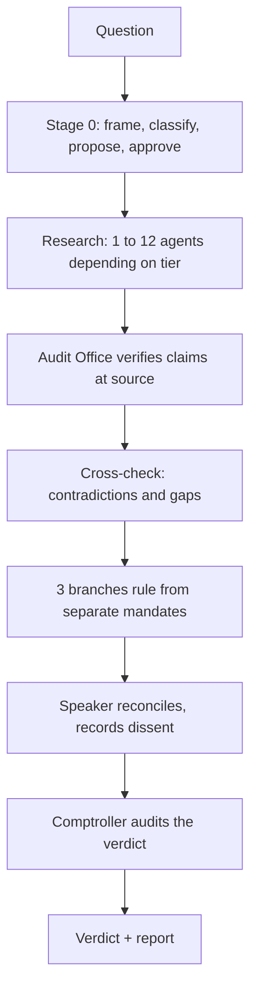

# Quorum

A deliberation skill for Claude Code. Puts a hard question to a small government instead of a single assistant, and verifies its own answers.


Most multi-agent setups ask several models the same question and synthesise the answers. Quorum adds an Audit Office that checks whether any of it is true, including a final audit of the verdict itself.

## Install

```bash
git clone https://github.com/Caleb-Boddington/quorum.git
cp -r quorum/spec ~/.claude/skills/quorum
```

Windows:

```powershell
git clone https://github.com/Caleb-Boddington/quorum.git
Copy-Item -Recurse quorum\spec $env:USERPROFILE\.claude\skills\quorum
```

## Usage

```
/quorum should we migrate off Postgres before the next funding round?
```

It stops before spending anything and asks which tier to run. It will not fire on its own.

## Tiers

| Tier | Agents | Structure |
|---|---|---|
| Rapporteur | 8 | 1 investigator, 1 shadow, 1 auditor, 3 branches, Speaker, Comptroller |
| Quick | 10 | 3 self-researching departments, 1 auditor, 1 cross-checker, + the above |
| Standard | 22 | 3 departments with researcher/scrutineer pairs, 3 auditors, 2 reviewers |
| Full | 38 | 6 departments, 12 workers, 6 auditors, 6 reviewers with distinct lenses |

Agent counts, not costs. A measured Full run used 38.3M tokens, of which 99.5% was cache. Cost tracks context carried per agent, not agent count.

Rapporteur is the recommended default. It beat Quick head to head on the same question with two fewer agents.

## How it works



Four bodies, each with one job and one prohibition:

- **Executive** rules on what follows in practice. May not rule on whether it is worth wanting.
- **Legislature** rules on whether it is the right question and what it costs. May not design the plan.
- **Judiciary** rules on whether the reasoning holds. **May not propose anything.**
- **Audit Office** verifies claims. Reports to none of the branches. May not hold an opinion on the answer.

Three rules hold the shape:

- Every tier gets less context than the tier above. Workers see one task; branches see everything.
- Nobody audits their own work.
- The dissent is published, at full strength, with the condition that would make it correct.

## Controls

Built by reasoning about failure, not from a framework, but several of the results are standard controls:

| Control | Status |
|---|---|
| Separation of duties | Held across every run |
| Three lines of defence | Third line has caught the second line's misses |
| Independent assurance | Implemented |
| Adversarial review | Implemented |
| Evidence provenance | Source, date and rank on every claim |
| Data classification at intake | Added after a real failure |
| Change control | Every defect and fix in `NOTES.md` |
| Input validation | In the spec, not enforced by code |
| Tamper-evident audit log | Absent |
| Abort mid-run | Absent |

See [SECURITY.md](SECURITY.md).

## Known limitations

- Every agent is the same model. Independence comes from prompts, not architecture. Five instances given one identical prompt produced the same answer, the same stated risk in near-identical words, and the same blind spot. Replicated across two model families, so a multi-model panel would not fix it.
- One agent with a strong prompt gets most of the way at a tenth the cost. Quorum's edge is the checking layers, not the research.
- Fifteen departmental reports, zero organic audit failures. The only FAIL came from a deliberately planted fault. Treat audit verdicts as a ranking, not a gate.
- Department selection at Stage 0 is unguarded. A run convened with deliberately wrong departments produced three competent reports, passed audit and cross-check, and died only at the branches after all the research was spent.
- No run has been instrumented for cost per tier beyond one Full run.
- Never run by anyone but the author, on any machine but his.

## Runs

The runs are the primary content. A specification decays; recorded runs age into evidence.

- [Quorum on Quorum](runs/2026-08-17-quorum-on-quorum.html), Full tier, 43 agents. Found four factual errors in its own spec, established that three of its claimed original ideas already exist in the literature under other names, and its Audit Office falsified an argument the Speaker invented at the final stage.
- [Britain's best dish](runs/2026-08-16-fish-and-chips.html), Quick tier, 10 agents. A trivial subject run to exercise the machinery. One department killed its own best argument after tracing a widely-repeated industry statistic to a condiment brand's ad campaign.

A third run is withheld. It was on a personal decision and contains private financial information. Its findings about the tool are in `NOTES.md`; only the subject is omitted.

## Background

When I was learning to use Claude and looking online for skills to help me criticise and develop my ideas, I came across the LLM Council. I used it for a while and was impressed, but it had a gap I kept hitting: five advisors give you five opinions and they review each other, but nobody ever checks whether any of it is true. You can end up with five well-argued answers resting on a number somebody invented.

So I started building my own. Quorum keeps the anonymous peer review, because that part works, and adds an Audit Office whose only job is verifying claims, including a final check on the verdict itself. It has already caught its own verdict out twice.

I also changed what the roles are for. The Council's five are personalities. Quorum's are functions with different jobs: one asks what follows in practice, one asks whether it is even the right question, one only tests whether the reasoning holds and is not allowed to propose anything at all. That felt fairer than roles with their own agendas.

Most people could use this. It earns its cost on the hard ones, where you are sitting there thinking *"I honestly have no idea what to do, there is too much information for me to sift through on my own"*, or *"I can't get this wrong, there is no room for error here."*

Caleb Boddington

Everything outside this section was written by Claude, including the reports that say so.

## Credits

The anonymous peer-review round is [Andrej Karpathy's](https://github.com/karpathy/llm-council). Three things this project previously called its own already exist in the literature: the per-question cabinet is DyLAN's dynamic team selection, the Audit Office is AutoAgents' observer role, and recorded dissent with "what would change my mind" is standard intelligence tradecraft under ICD 203.

## Licence

MIT
