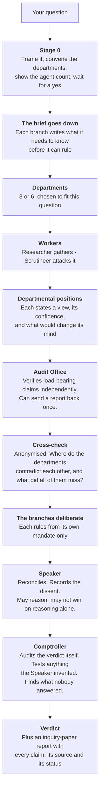

# Quorum

A deliberation skill for Claude Code. It puts a hard question to a small government instead of a single assistant, and it verifies its own answers.

---

## Why I built it

When I was learning to use Claude and looking online for skills to help me criticise and develop my ideas, I came across the LLM Council. I used it for a while and was impressed, but it had a gap I kept hitting: five advisors give you five opinions and they review each other, but **nobody ever checks whether any of it is true.** You can end up with five well-argued answers resting on a number somebody invented.

So I started building my own. Quorum keeps the anonymous peer review, because that part works, and adds an Audit Office whose only job is verifying claims, including a final check on the verdict itself. It has already caught its own verdict out twice.

I also changed what the roles are for. The Council's five are personalities. Quorum's are functions with different jobs: one asks what follows in practice, one asks whether it is even the right question, one only tests whether the reasoning holds and is not allowed to propose anything at all. That felt fairer than roles with their own agendas.

Most people could use this. It earns its cost on the hard ones, where you are sitting there thinking *"I honestly have no idea what to do, there is too much information for me to sift through on my own"*, or *"I can't get this wrong, there is no room for error here."*

**Caleb Boddington**

---

## The four bodies

Everything below this line was written by Claude, including the report that says so.

| Body | Its one job | What it may not do |
|---|---|---|
| **Executive** | What follows from this in practice. Sequence, dependencies, the first move. | Rule on whether the thing is worth wanting. |
| **Legislature** | Whether this is the right question, what answering it costs, and whose definition of the key term got quietly adopted. | Design the plan. |
| **Judiciary** | Whether the reasoning holds and the evidence supports it. | **Propose anything.** A Judiciary that starts proposing has become a second Executive. |
| **Audit Office** | Verify the claims. Reports to none of the three. | Have an opinion on the answer. |

Beneath the branches sit **departments**, convened fresh for each question. A pricing question and a career question get different cabinets. Each department runs two workers: a **Researcher** who gathers, and a **Scrutineer** whose only job is attacking what the Researcher found.

At the end, a **Speaker** reconciles rather than counting votes. It may side with one branch against the other two if the argument is better, and it must write down the position it overruled, along with what would have to be true for that position to win.

## How a run works

Three rules hold the shape together.

**Every tier gets less context than the tier above.** Workers see one task. Departments see their own two workers. Auditors see one department. Branches see everything. A researcher who can see the whole question starts answering the whole question instead of their piece of it.

**Nobody audits their own work.** An agent asked whether it did a good job says yes. Every check is performed by an agent that did not produce the thing being checked.

**The dissent is published.** If the Speaker overrules a branch, the overruled argument appears in the report at full strength, with the condition that would make it correct. Six months later that is the first thing worth re-reading.

## The three tiers

| | Departments | Workers | Cross-check | Agents |
|---|---|---|---|---|
| **Quick** | 3, self-researching | none | 1 checker | **10** |
| **Standard** | 3 | 6 | 2 reviewers | **22** |
| **Full** | 6 | 12 | 6 reviewers | **38** |

All three do the same six jobs. Going down a tier buys less coverage, never a missing kind of check. The Audit Office and the Comptroller run at every tier.

**These are agent counts, not costs.** No run has ever been instrumented. Treat the table as a rough ordering, not a price list.

## What it is not

Read [`spec/SKILL.md`](spec/SKILL.md) for the full limits section. The short version:

- **Every agent is the same model wearing a different hat.** Karpathy's independence came from using different models. Measured on 17 August 2026: five instances of one model, given one identical prompt, produced the same recommendation, the same stated risk in near-identical words, and the same blind spot. Independence here is a property of the prompts, not the architecture.
- **No baseline exists.** Nobody has shown Quorum beating one competent session with a good prompt, and there is published work suggesting it may not.
- **Fifteen departmental reports have produced zero audit failures.** The only FAIL ever recorded came from a fault deliberately planted by the author. Treat audit verdicts as a ranking, not a gate.

## What is in this repository

| | |
|---|---|
| [`runs/`](runs/) | Quorum's actual output, as reports. This is the primary content. A specification decays; recorded runs age into evidence. |
| [`spec/`](spec/) | The skill itself. `SKILL.md`, the prompt templates, the report specification. |
| [`NOTES.md`](NOTES.md) | The development log. Every defect found, what caused it, what changed, and the ones still unfixed. |

### The runs

**[Quorum on Quorum](runs/2026-08-17-quorum-on-quorum.html)**, 17 August 2026, Full tier, 43 agents. Quorum examining its own design on the eve of publication. It found four factual errors in its own specification, established that three of its claimed original ideas already exist in the literature under other names, and its Audit Office falsified an argument the Speaker had invented at the final stage. The run begins with a controlled experiment: five copies of one model, one identical prompt, measuring whether they genuinely disagree. They did not.

**[Britain's best dish](runs/2026-08-16-fish-and-chips.html)**, 16 August 2026, Quick tier, 10 agents. A deliberately trivial subject, run to exercise the machinery cheaply. Worth reading for the mechanism rather than the answer: one department killed its own best argument after tracing a widely-repeated industry statistic to a condiment brand's advertising campaign.

**A third run is withheld.** It was the first Quorum ever did, on a personal decision, and its report contains private financial information. Its findings about the tool are recorded in full in `NOTES.md`; only the subject matter is omitted. Anonymising it properly was possible but the material added nothing the other two runs do not already show.

## Running it

Copy `spec/` into `.claude/skills/quorum/` and invoke it with `/quorum`. It will not fire on its own, by design: `disable-model-invocation: true` is set, because a run costs between ten and thirty-eight sub-agents and nobody should discover that after the fact.

Known limitation, found by the run above: that same setting blocks programmatic invocation, so a scheduled task cannot load the skill and has to follow `SKILL.md` directly.

## Licence

MIT. Use it, fork it, take the parts that work. If you find a defect the Audit Office missed, that is the most useful thing you could send back.
